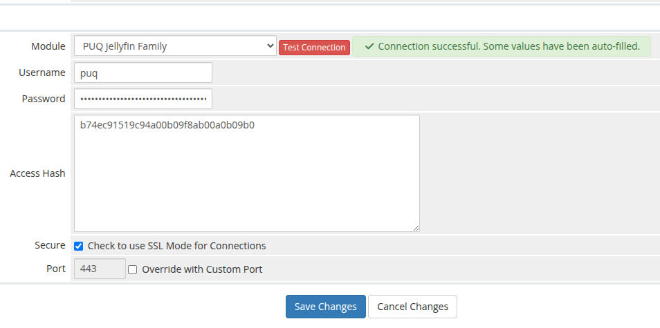

# Add a Jellyfin server in WHMCS

### Jellyfin Family module **[WHMCS](https://puqcloud.com/link.php?id=77)**
#####  [Order now](https://puqcloud.com/whmcs-module-jellyfin-family.php) | [Download](https://download.puqcloud.com/WHMCS/servers/PUQ_WHMCS-Jellyfin-Family/) | [Community](https://community.puqcloud.com/)

Configure the connection to your Jellyfin server under **System Settings → Servers → Add New Server**.

| Field | Value |
|-------|-------|
| **Name** | A label for the server. |
| **Hostname / IP Address** | The Jellyfin server hostname or IP. |
| **Module** | `PUQ Jellyfin Family`. |
| **Username** | A Jellyfin **administrator** username. |
| **Password** | That administrator's password. |
| **Access Hash** | A Jellyfin **API key** (Jellyfin Dashboard → API Keys). |
| **Secure (SSL)** | Enable if Jellyfin is served over HTTPS. |
| **Port** | Jellyfin port (default `8096`, or `443` when SSL is enabled). |

In the **Server Details** section select **Module → PUQ Jellyfin Family**, fill in the **Username**, **Password** and **Access Hash** (API key), tick **Secure** for SSL and set the **Port**.

Use **Test Connection** to confirm WHMCS can reach Jellyfin and authenticate. The module authenticates with the username / password + API key to obtain an access token, then calls `System/Info` to verify connectivity. On success some fields are auto-filled and the status shows **Connection successful**.

Finally, assign the server (or a server group that contains it) to your Jellyfin Family product under the product's **Module Settings**.
