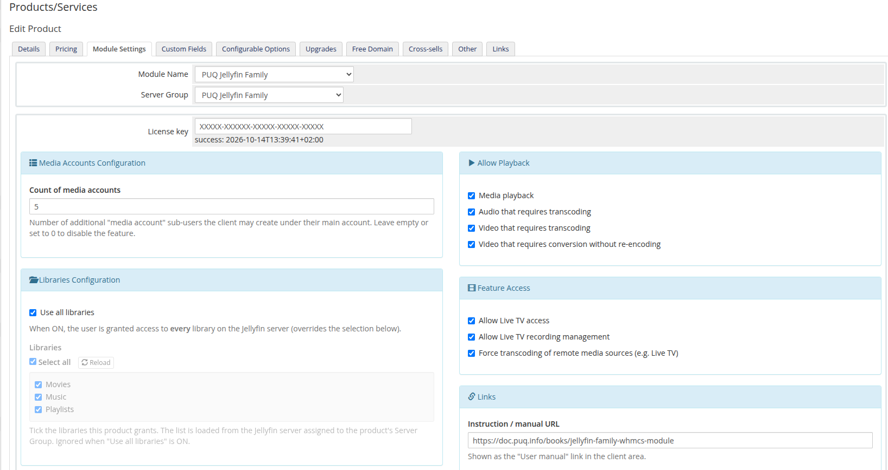
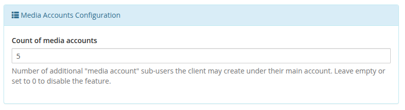
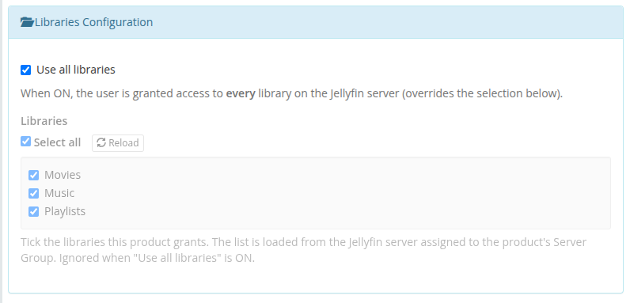
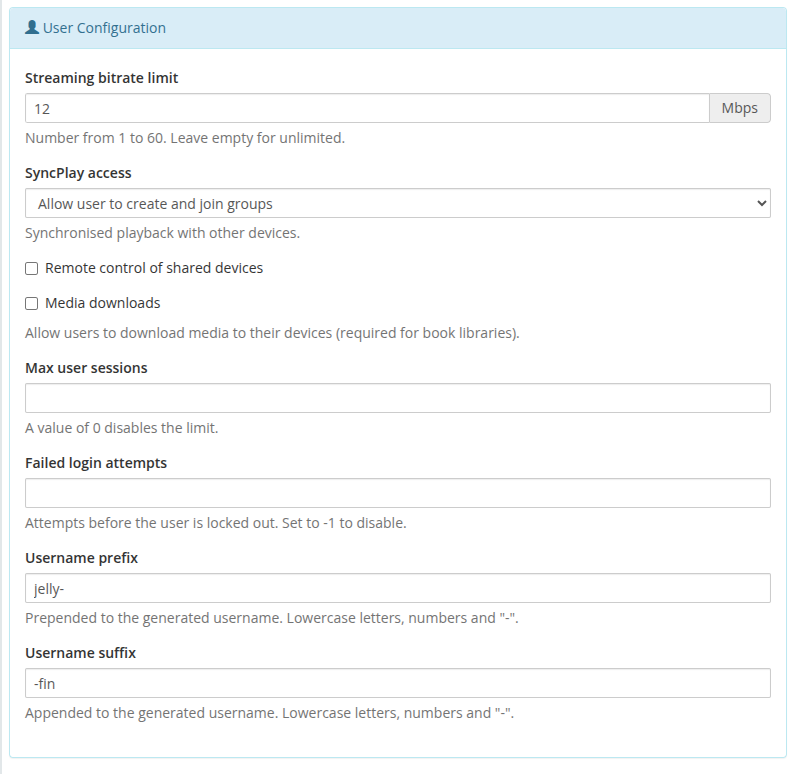
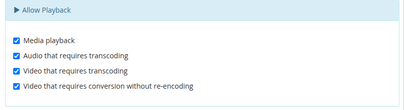
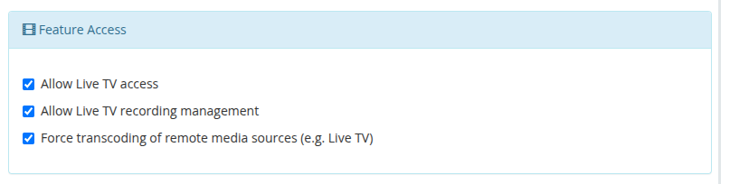
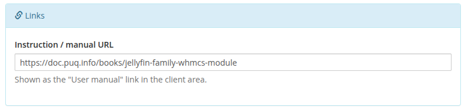
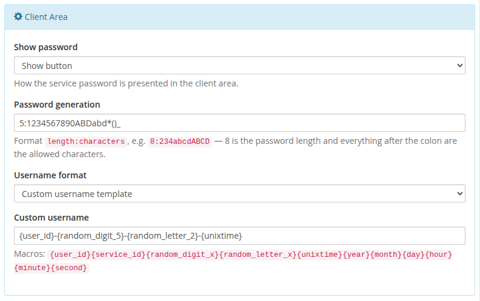

# Product configuration

### Jellyfin Family module **[WHMCS](https://puqcloud.com/link.php?id=77)**
#####  [Order now](https://puqcloud.com/whmcs-module-jellyfin-family.php) | [Download](https://download.puqcloud.com/WHMCS/servers/PUQ_WHMCS-Jellyfin-Family/) | [Community](https://community.puqcloud.com/)

Create a product of type **PUQ Jellyfin Family** (Setup → Products/Services), assign the Jellyfin server on the **Module Settings** tab, then configure the access policy in the injected configuration panel.

## Media Accounts Configuration
- **Count of media accounts** — how many additional **media accounts** (sub-users) the client may create under their main account. Leave empty or set to `0` to disable the feature for this product. When set to a positive number, a *Media Accounts* card appears in the client area where the client can add up to that many sub-users.

> Each media account is a separate Jellyfin user named `mainusername-name`. It inherits the product's playback / transcoding / Live TV / SyncPlay / session settings, but its library access is limited to a subset of the main account's libraries (chosen per media account). Setting the count to `0` removes all existing media accounts on the next *Change package*.

## Libraries Configuration
- **Use all libraries** — grant access to every library on the server (overrides the selection below).
- **Libraries** — the list of libraries is loaded live from the Jellyfin server assigned to the product's Server Group. Tick the libraries this product grants; use **Select all** to toggle everything, or **Reload** to refresh the list. Leaving everything unticked grants no library. If the server cannot be reached, a manual text box appears as a fallback (one library name per line). Ignored when "Use all libraries" is ON.

> The dynamic list requires the product to be saved with a Server Group that contains a reachable Jellyfin server. Until then the panel shows a hint to select and save a Server Group.

## User Configuration
- **Streaming bitrate limit** — 1–60 Mbps (empty = unlimited).
- **SyncPlay access** — create & join groups / join groups / disabled.
- **Remote control of shared devices**, **Media downloads** — on/off.
- **Max user sessions** — `0` disables the limit.
- **Failed login attempts** — lockout threshold; `-1` disables it.
- **Username prefix / suffix** — wrap the generated username.

## Allow Playback
Toggle media playback, audio transcoding, video transcoding and video conversion without re-encoding.

## Feature Access
Live TV access, Live TV recording management, and force transcoding of remote media sources.

## Links
- **Instruction / manual URL** — shown as the *User manual* link in the client area.

## Client Area
- **Show password** — show button / plain text / hidden.
- **Password generation** — `length:characters`, e.g. `8:23456789abcdABCD`.
- **Username format** — `standard` (`prefix<client_id>-<service_id>suffix`) or `custom`.
- **Custom username** — macro template: `{user_id}`, `{service_id}`, `{random_digit_x}`, `{random_letter_x}`, `{unixtime}`, `{year}`, `{month}`, `{day}`, `{hour}`, `{minute}`, `{second}`.

Settings are stored as a single JSON document in `configoption24`. After saving, **Create/Change** actions push the resulting policy to Jellyfin.
