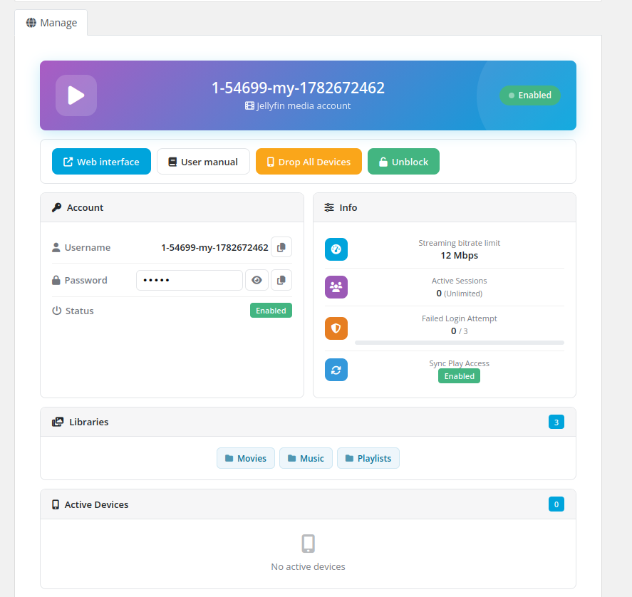
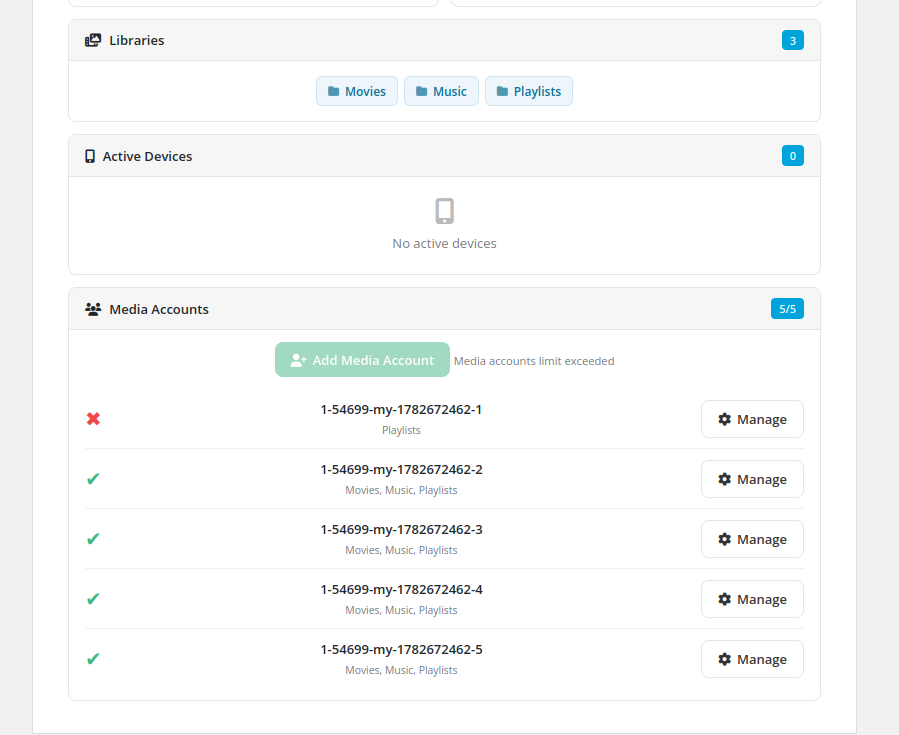

# Client area overview

### Jellyfin Family module **[WHMCS](https://puqcloud.com/link.php?id=77)**
#####  [Order now](https://puqcloud.com/whmcs-module-jellyfin-family.php) | [Download](https://download.puqcloud.com/WHMCS/servers/PUQ_WHMCS-Jellyfin-Family/) | [Community](https://community.puqcloud.com/)

The client opens their Jellyfin Family service from **clientarea.php → My Services → (service) → Information**. The page loads its data over AJAX and renders a set of cards.

## Actions
- **Web interface** — opens the Jellyfin web UI in a new tab.
- **User manual** — opens the instruction URL configured on the product (if set).
- **Drop All Devices** — signs the account out of every device (confirmation required).
- **Unblock** — re-enables the account when it has been locked/disabled (shown only when disabled).

## Account
- **Username** with a copy button.
- **Password** — shown as a reveal button, plain text, or hidden, depending on the product's *Show password* setting; with a copy button.
- **Status** — Enabled / Disabled badge.

## Info
- Streaming bitrate limit, active sessions (with the max), failed-login attempts (with the lockout threshold), and SyncPlay access.

## Libraries & Devices
- **Libraries** — chips for each library the user can access (with a count badge).
- **Active Devices** — table of device name, app and last activity (with a count badge).

## Media Accounts
When the product allows media accounts, a **Media Accounts** card lists the client's sub-users with a `used / limit` count badge.

- **Add Media Account** — opens a modal to enter a username (the main username is prefixed automatically), generate a password and tick which libraries the sub-user may access. Disabled once the limit is reached.
- **Manage** (per media account) — opens a modal to enable/disable the sub-user, change its password (leave empty to keep the current one), adjust its libraries, view and **drop its active devices**, or **delete** the media account (confirmation required).

A media account's available libraries are always a subset of the main account's libraries, and it inherits the product's playback/transcoding/feature settings.

All actions use AJAX and report the result with a toast notification — the page never reloads.
